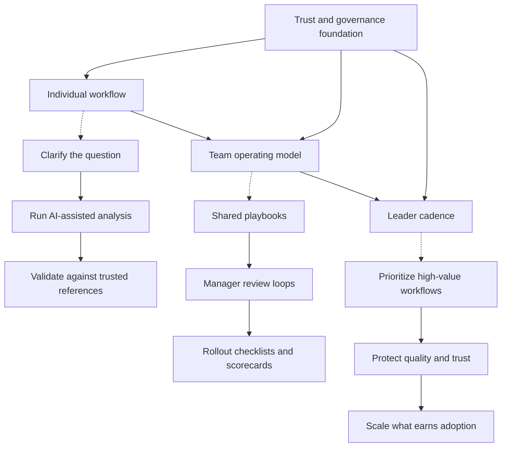

# AI+Data

Operator-grade playbooks for AI-native data leadership.

AI+Data is a public working repo for Chief Data Officers, heads of data, analytics leaders, and high-agency builders who want to adopt AI without giving up rigor. The point of view is simple: the teams that win with AI are not the ones with the flashiest prompts. They are the ones with the clearest metrics, strongest operating habits, safest review loops, and most disciplined leadership cadence.

| Public proof | Why it matters |
| --- | --- |
| `600+` blog posts | Long-running public writing archive on analytics, data science, BI, and data leadership |
| `2M+` visitors | Public evidence that the ideas have been refined in the open over time |
| `5K+` followers | Community traction around the writing and operating perspective |

## What Makes This Repo Different

- It is built for data leaders, not just prompt tinkerers.
- It treats trust, validation, and governance as part of AI adoption, not cleanup work.
- It focuses on repeatable operating patterns that teams can actually roll out.
- It stays public-safe by design: generalized lessons, synthetic examples, no company internals.

## Signature Artifacts

These are the highest-signal entry points if you want the executive layer, not just the tactical layer.

| Artifact | Why start here |
| --- | --- |
| [`docs/how-i-lead.md`](./docs/how-i-lead.md) | Public-safe operating principles for how Paras approaches data leadership, AI adoption, team design, and trust |
| [`docs/cdo-operating-system.md`](./docs/cdo-operating-system.md) | A signature CDO artifact: 90-day roadmap, KPI tree, governance model, and operating cadence |
| [`docs/ai-adoption-board-brief.md`](./docs/ai-adoption-board-brief.md) | A one-page executive brief for reporting AI adoption progress, risk, and next decisions |
| [`docs/public-safe-impact-patterns.md`](./docs/public-safe-impact-patterns.md) | Generalized before/after impact patterns that show what better looks like in practice |
| [`playbooks/from-playbooks-to-operating-systems.md`](./playbooks/from-playbooks-to-operating-systems.md) | Clarifies the difference between public playbooks, reusable toolkits, and real AI operating systems |

## Public-Safe Case Studies

These are concise, sanitized case-study style walkthroughs that show how the operating patterns change a system, not just a document.

| Case study | What changed |
| --- | --- |
| [`docs/case-studies/decision-cadence-reset.md`](./docs/case-studies/decision-cadence-reset.md) | How a reactive weekly review becomes a decision-ready operating forum |
| [`docs/case-studies/trust-layer-rollout.md`](./docs/case-studies/trust-layer-rollout.md) | How a fragmented metric environment becomes an AI-ready trust layer |
| [`docs/case-studies/analytics-org-consolidation.md`](./docs/case-studies/analytics-org-consolidation.md) | How multiple analytics teams become one higher-leverage operating system |

## Operating Model

## Start Here By Audience

| Audience | Start here |
| --- | --- |
| CDO / Head of Data | [`docs/reading-paths.md`](./docs/reading-paths.md), [`playbooks/durable-priorities-for-ai-native-data-leadership.md`](./playbooks/durable-priorities-for-ai-native-data-leadership.md), [`toolkits/manager-ai-adoption-scorecard.md`](./toolkits/manager-ai-adoption-scorecard.md) |
| Manager / Analytics Leader | [`docs/reading-paths.md`](./docs/reading-paths.md), [`toolkits/data-team-ai-rollout-checklist.md`](./toolkits/data-team-ai-rollout-checklist.md), [`playbooks/ask-before-building.md`](./playbooks/ask-before-building.md) |
| Senior IC / Builder | [`playbooks/self-correcting-sql-loop.md`](./playbooks/self-correcting-sql-loop.md), [`playbooks/fix-ai-analytics-inputs-not-prompts.md`](./playbooks/fix-ai-analytics-inputs-not-prompts.md), [`examples/synthetic-funnel/README.md`](./examples/synthetic-funnel/README.md) |

## Start Here By Problem

| If you are trying to... | Read this |
| --- | --- |
| Get better answers from AI analytics | [`playbooks/fix-ai-analytics-inputs-not-prompts.md`](./playbooks/fix-ai-analytics-inputs-not-prompts.md) |
| Make SQL generation more reliable | [`playbooks/self-correcting-sql-loop.md`](./playbooks/self-correcting-sql-loop.md) |
| Stop AI from guessing metric definitions | [`playbooks/semantic-layer-is-the-trust-layer.md`](./playbooks/semantic-layer-is-the-trust-layer.md) |
| Decide what context an agent should trust | [`playbooks/why-agents-need-a-metric-store.md`](./playbooks/why-agents-need-a-metric-store.md) |
| Roll AI out across a team safely | [`toolkits/data-team-ai-rollout-checklist.md`](./toolkits/data-team-ai-rollout-checklist.md) |
| Create a leader-level operating cadence | [`playbooks/durable-priorities-for-ai-native-data-leadership.md`](./playbooks/durable-priorities-for-ai-native-data-leadership.md) |

## Featured Playbooks

| Playbook | What it does |
| --- | --- |
| [`playbooks/self-correcting-sql-loop.md`](./playbooks/self-correcting-sql-loop.md) | Turns AI from one-shot SQL generation into an iterative analysis loop with human validation at the end |
| [`playbooks/ask-before-building.md`](./playbooks/ask-before-building.md) | Standardizes the clarification step before metrics, dashboards, models, or analysis work begins |
| [`playbooks/fix-ai-analytics-inputs-not-prompts.md`](./playbooks/fix-ai-analytics-inputs-not-prompts.md) | Explains why structured context beats prompt tweaking for reliable analytics answers |
| [`playbooks/semantic-layer-is-the-trust-layer.md`](./playbooks/semantic-layer-is-the-trust-layer.md) | Frames the semantic layer as trust infrastructure for AI analytics |
| [`playbooks/why-agents-need-a-metric-store.md`](./playbooks/why-agents-need-a-metric-store.md) | Adds the missing layer between discovery and approved answers for conversational analytics |
| [`playbooks/durable-priorities-for-ai-native-data-leadership.md`](./playbooks/durable-priorities-for-ai-native-data-leadership.md) | Highlights the durable operating priorities that matter even as tools change |

## Hands-On Example

The best first proof is not a giant platform build. It is a safe, repeatable workflow.

Start with [`examples/synthetic-funnel/README.md`](./examples/synthetic-funnel/README.md). It walks through the full loop on synthetic data:

1. ingest safe data
2. frame the question clearly
3. run AI-assisted analysis
4. validate against trusted logic
5. translate the result into a manager-ready recommendation

## What Better Looks Like

The strongest data leaders do more than ship analysis. They redesign the system around the analysis.

- They replace reactive reporting with decision-ready operating cadences.
- They replace fragmented analytics with shared definitions, ownership, and trust signals.
- They replace one-off heroics with repeatable workflows, stronger managers, and better self-serve habits.

The public-safe versions of those patterns live in [`docs/public-safe-impact-patterns.md`](./docs/public-safe-impact-patterns.md), [`docs/cdo-operating-system.md`](./docs/cdo-operating-system.md), and the case studies above.

## Repo Map

| Path | Purpose |
| --- | --- |
| [`playbooks/`](./playbooks) | Reusable operating patterns for AI-native data work |
| [`toolkits/`](./toolkits) | Rollout checklists, scorecards, and reusable templates |
| [`examples/`](./examples) | Synthetic, public-safe walkthroughs |
| [`docs/`](./docs) | Founder context, signature artifacts, reading paths, source inventory, and publication guardrails |

## Public-Safety Promise

- No company-specific strategy, SQL, schemas, dashboards, or internal identifiers
- No customer, employee, or candidate data
- No private operating docs pasted into public files
- No claims that depend on private context

See [`docs/repo-privacy-policy.md`](./docs/repo-privacy-policy.md), [`docs/publication-safety-checklist.md`](./docs/publication-safety-checklist.md), and [`docs/public-source-inventory.md`](./docs/public-source-inventory.md).

## About Paras

AI+Data is curated by Paras Doshi (`parasdoshi`). The perspective here is intentionally operator-led: write down the patterns a strong data leader would actually use to help a team adopt AI responsibly, then publish only the public-safe version. More on the editorial lens lives in [`docs/founder.md`](./docs/founder.md).

## Further Reading From Paras

- [How Data Leaders Can Actually Enable Enterprise AI](https://insightextractor.com/2025/05/03/how-data-leaders-can-actually-enable-enterprise-ai/)
- [Stop Losing the Room: Turning Data Insights into Decisions](https://insightextractor.com/2025/05/26/stop-losing-the-room-turning-data-insights-into-decisions/)
- [Ad-Hoc Requests: How Great Data Teams Turn Noise into Influence](https://insightextractor.com/2025/05/29/ad-hoc-requests-how-great-data-teams-turn-noise-into-influence/)
- [The Data Leader’s Secret Weapon: The Deprecation-First Rule for Managing Technical Debt](https://insightextractor.com/2025/07/31/the-data-leaders-secret-weapon-the-deprecation-first-rule-for-managing-technical-debt/)
- [Structuring a High-Impact Data Team: Centralized vs. Decentralized Models](https://insightextractor.com/2025/03/06/structuring-a-high-impact-data-team-centralized-vs-decentralized-models/)
- [Why Your Amazon-Style WBR Isn’t Working (and How to Fix It)](https://insightextractor.com/2025/04/07/why-your-amazon-style-wbr-isnt-working-and-how-to-fix-it/)

## Selected Public References

- [Insight Extractor archive](https://insightextractor.com/list-of-all-blog-posts-by-paras-doshi/)
- [Institute of Analytics Fellow profile](https://ioaglobal.org/ioa-fellows/paras-doshi/)
- [High Signal episode: Why Your Data Team Doesn't Have a Seat at the Table (And How to Earn It)](https://highsignal.fireside.fm/27)
- [Podcast: Data leadership and strategy](https://www.youtube.com/watch?v=q7Mpqm1GVRc&list=PLHow-wjRD8TEX4idQj4bDdNvNer-ar9x7&index=2)
- [Podcast: Building data teams](https://www.youtube.com/watch?v=DDSKxL_JeLc)
