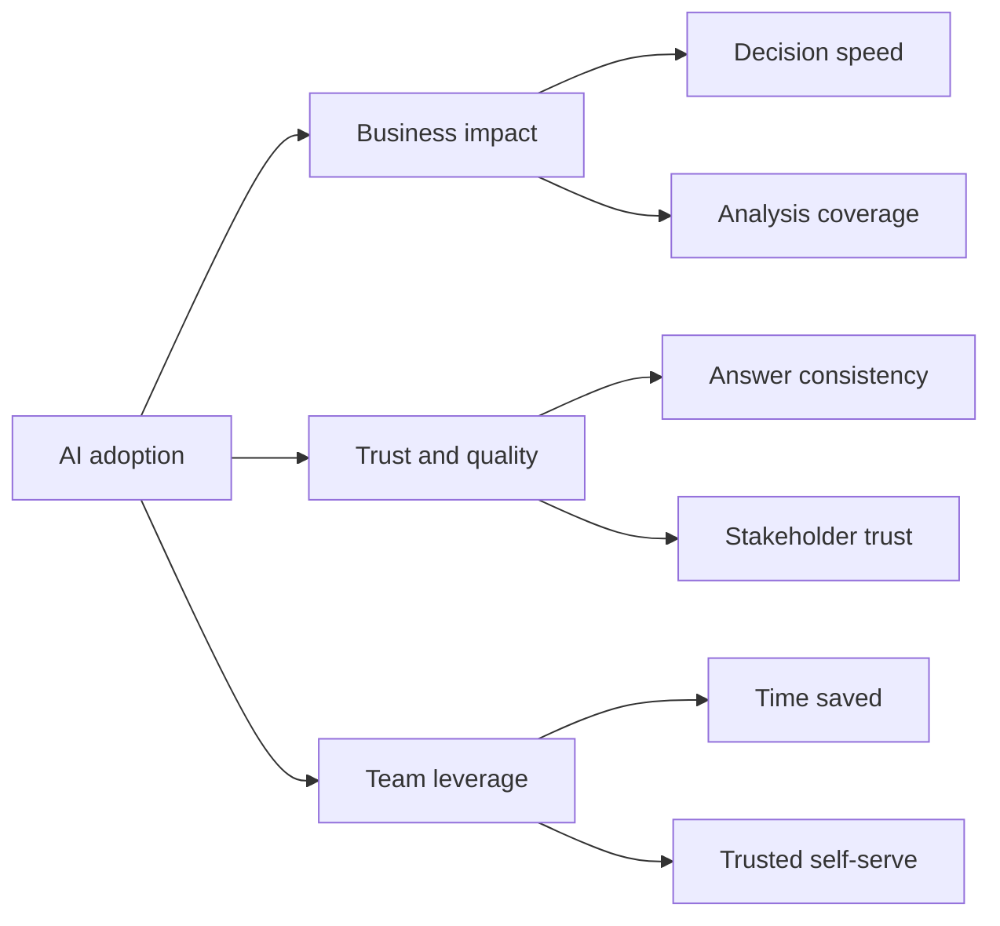

# AI Adoption Board Brief

This is a one-page template for how a CDO or head of data can brief executive leadership on AI adoption without turning the conversation into a tooling demo.

## Executive Summary

| Area | Current read | What leadership should know |
| --- | --- | --- |
| Business impact | `On track` | AI is improving leverage in recurring workflows, but the value is concentrated where trust and review loops are strongest |
| Trust and quality | `Needs constant attention` | Reliability is improving, but metric consistency and approved answer paths still determine whether outputs get used |
| Team leverage | `Improving` | The team is getting faster where workflows are standardized; ad-hoc heroics remain a drag where standards are weak |
| Governance | `Critical path` | Clear definitions, safe data boundaries, and review rules are the difference between scalable adoption and flashy inconsistency |

## KPI Snapshot

| KPI family | Example measures |
| --- | --- |
| Business impact | cycle time to answer recurring questions, increase in analysis coverage, better prioritization decisions |
| Trust and quality | repeated phrasings return the same answer, lower review defect rates, fewer reconciliation loops |
| Team leverage | time saved on recurring work, more reuse of trusted artifacts, higher manager confidence in AI-assisted output |

## Progress By Layer

| Layer | Status | What good looks like next |
| --- | --- | --- |
| Individual workflow | `Working in pockets` | more repeatable prompts, stronger validation loops, fewer one-off experiments |
| Team operating model | `Scaling selectively` | shared examples, tighter manager reviews, clearer preferred workflows |
| Leader cadence | `Becoming explicit` | regular scorecards, stronger deprecation habits, clear investment decisions |
| Trust foundation | `Still decisive` | official metric definitions, trusted dashboards, approved answer paths, safe AI boundaries |

## Top Risks

| Risk | Why it matters | Mitigation |
| --- | --- | --- |
| Inconsistent definitions | AI scales confusion if the metric layer is fuzzy | narrow to official metrics and trusted sources first |
| Tool-first rollout | adoption looks impressive before it becomes reliable | measure trust and repeatability before broader scale |
| Manager quality gap | weak review habits cap the value of AI workflows | train managers on workflow design and review quality |
| Asset sprawl | more dashboards and queries create more conflict | use deprecation and trusted-asset governance aggressively |

## Decisions Needed In The Next 30 Days

- Which recurring workflow is worth scaling next?
- Which dashboards or metrics should become the trusted default?
- Where is human review still mandatory?
- Which stale assets should be deprecated before adding new ones?

## Why This Format Works

It keeps the executive conversation focused on operating change:

- what is improving
- what still blocks scale
- what decisions leadership needs to make next

## Related Next Reads

- [`cdo-operating-system.md`](./cdo-operating-system.md)
- [`public-safe-impact-patterns.md`](./public-safe-impact-patterns.md)
- [`../toolkits/manager-ai-adoption-scorecard.md`](../toolkits/manager-ai-adoption-scorecard.md)
