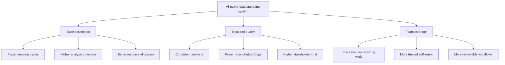

# CDO Operating System For AI-Native Data Teams

This is a public-safe operating model for a CDO or head of data who wants to make AI adoption real without sacrificing rigor.

## What This Artifact Is For

Use this when you need to turn broad ambition into a concrete operating system:

- what gets prioritized
- what gets governed
- what gets measured
- how leadership reviews happen

## 90-Day Roadmap

### Days 1-30: Establish the trust layer

- identify the top decision forums and the metrics that drive them
- define the smallest set of business-critical metrics
- document trusted sources, owners, and key caveats
- choose one recurring workflow for AI-assisted execution
- set red lines for PII, secrets, and unsafe data usage

### Days 31-60: Standardize the workflow

- roll out a mandatory clarification step before build work begins
- move trusted queries, definitions, and examples into version control
- establish manager review loops for AI-assisted outputs
- create one or two reference workflows the team can reuse
- track where trust breaks and why

### Days 61-90: Scale what earns trust

- expand from one workflow to a small portfolio of repeatable use cases
- tighten dashboard governance and trusted artifact selection
- expose definitions, context, and approved answer paths to AI workflows
- coach managers on review quality, not just prompt quality
- decide what to scale, what to pause, and what to redesign

## KPI Tree

Use a simple tree that connects AI adoption to operating outcomes:

### 1. Business impact

- faster decision cycles
- higher analysis coverage
- improved resource allocation quality
- fewer avoidable escalations on recurring questions

### 2. Trust and quality

- repeated questions return the same answer
- fewer "numbers do not match" incidents
- lower review defect rates
- higher stakeholder willingness to act on the output

### 3. Team leverage

- time saved on recurring work
- increase in self-serve usage on trusted surfaces
- more workflows that can be reviewed rather than rebuilt from scratch
- stronger manager confidence in what can be delegated to AI

## Governance Model

The minimum viable governance layer should define:

- which data is allowed in AI-assisted workflows
- which metrics are official
- who owns each critical definition
- where human review is mandatory
- how deprecated dashboards, metrics, and workflows are retired

The key rule: governance should make safe usage easier, not just block unsafe usage.

| Layer | Minimum decision |
| --- | --- |
| Data access | What is safe to use in AI-assisted workflows |
| Metric definitions | Which numbers are official and who owns them |
| Trusted artifacts | Which dashboards, queries, and reports AI should prefer |
| Human review | Where approval is mandatory before sharing or acting |
| Deprecation | How stale assets are retired before new ones proliferate |

## Recurring Cadence

### Weekly

- review one live workflow
- inspect errors, corrections, and trust breaks
- decide what to standardize or deprecate

### Monthly

- review the AI adoption scorecard
- assess which use cases gained trust and which did not
- identify manager coaching gaps
- narrow the list of trusted dashboards and metrics

### Quarterly

- revisit the top decision forums
- refresh the KPI tree and ownership map
- retire stale assets
- decide the next portfolio of workflows to scale

## Decision Forum Design

A strong decision forum should answer:

- what changed
- why it changed
- what matters now
- what decision is needed
- what follow-up owner and due date exist

If a forum cannot answer those five questions clearly, it is not yet decision-ready.

## What Good Looks Like

You know the operating system is working when:

- leaders ask for fewer reconciliations
- managers coach workflow quality instead of isolated prompting tricks
- analysts spend less time re-answering the same question
- trusted metrics and workflows become easier to find than untrusted ones

## Why This Is Not Just Theory

This artifact is intentionally generalized, but there are public signals showing that this style of operating model maps to real systems and measurable outcomes.

- a third-party case study on Opendoor's analytics transformation reports time-to-triage falling from 2 hours to 15 minutes, severe incidents dropping by 67 percent, internal NPS improving by 20 percent, and analytics costs falling by 80 percent year-over-year
- an official Institute of Analytics Fellow profile describes Paras as Head of Data at Opendoor leading analytics and engineering teams that power billions in real estate transactions
- a public Opendoor article describes an AI valuation system using 500+ property signals, 250,000+ transactions, and 20 external sources

See [`external-proof-of-impact.md`](./external-proof-of-impact.md) for the full source list and caveats.

## Related Next Reads

- [`how-i-lead.md`](./how-i-lead.md)
- [`public-safe-impact-patterns.md`](./public-safe-impact-patterns.md)
- [`external-proof-of-impact.md`](./external-proof-of-impact.md)
- [`../toolkits/manager-ai-adoption-scorecard.md`](../toolkits/manager-ai-adoption-scorecard.md)
